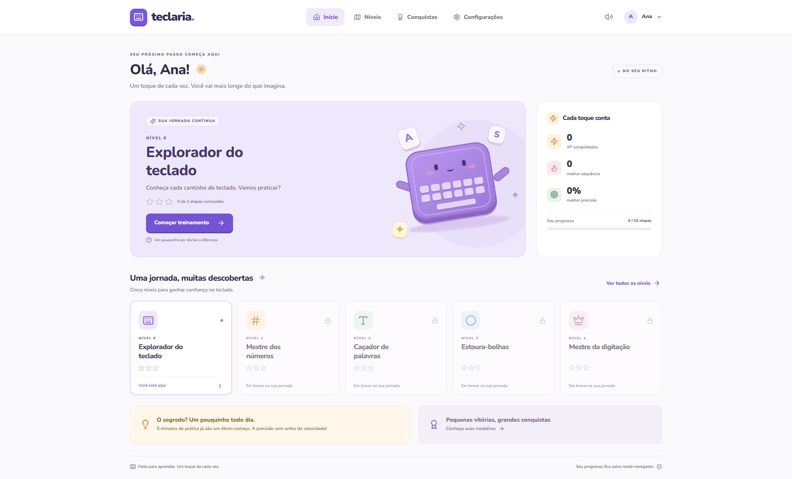
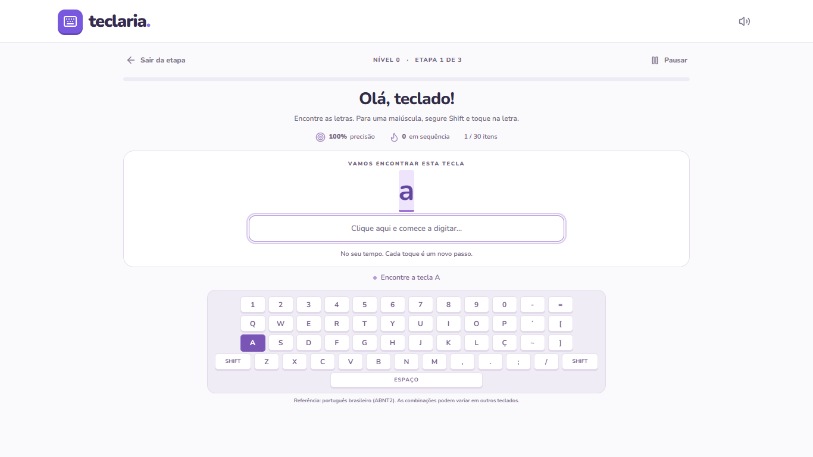
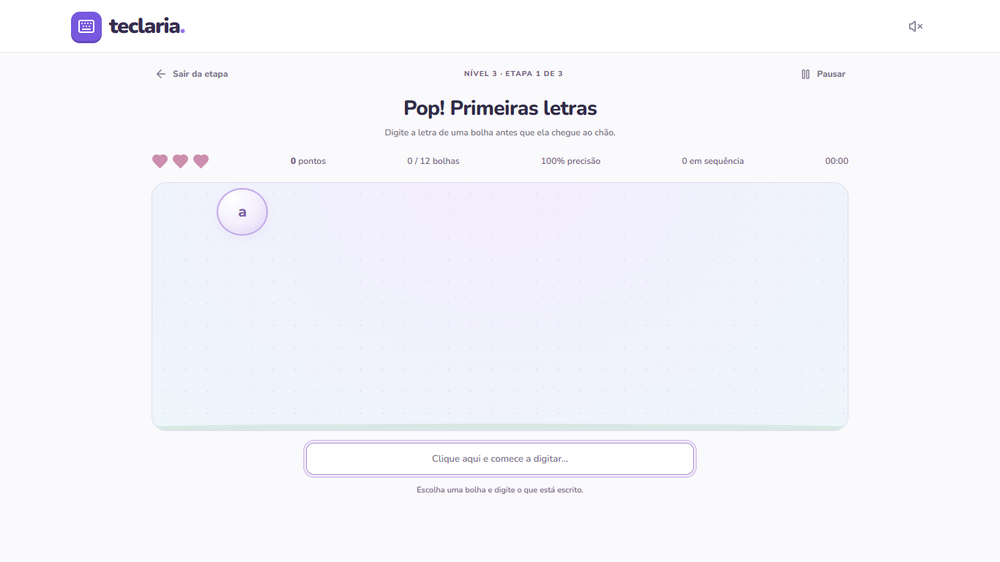

# Teclaria · Um toque de cada vez

Uma aplicação de treinamento de digitação para iniciantes. A jornada começa nas letras e no Shift, apresenta teclas especiais com imagens e voz, passa por números, palavras e bolhas e chega a parágrafos avançados. Cada etapa oferece feedback gentil, XP e conquistas.

**100% frontend:** sem servidor de aplicação, autenticação, banco de dados ou serviços externos obrigatórios. O nome apenas personaliza a interface. Dados e preferências ficam no `localStorage` do próprio navegador.

## Prévia



| Tela                            | Prévia                                              |
| ------------------------------- | --------------------------------------------------- |
| Treinamento com teclado virtual |   |
| Jogo das bolhas                 |  |

## Executar localmente

Use **Node.js 22 LTS** e npm. Na raiz do projeto:

```bash
npm install
npm run dev
```

Abra a URL exibida pelo Vite, normalmente `http://localhost:5173`. Para instalações reproduzíveis, use `npm ci` com o `package-lock.json` versionado.

| Comando                | O que faz                                          |
| ---------------------- | -------------------------------------------------- |
| `npm run dev`          | Inicia o servidor de desenvolvimento               |
| `npm test`             | Executa os testes unitários com Vitest             |
| `npm run test:watch`   | Executa testes unitários durante o desenvolvimento |
| `npm run test:e2e`     | Executa os testes de navegador com Playwright      |
| `npm run build`        | Verifica TypeScript estrito e gera `dist/`         |
| `npm run preview`      | Serve a versão de produção localmente              |
| `npm run format`       | Formata código e documentação                      |
| `npm run format:check` | Verifica a formatação                              |

Os testes de navegador usam Edge no Windows e Chromium nas outras plataformas. Para Chromium, execute `npx playwright install chromium`. Você pode definir `PLAYWRIGHT_CHANNEL=chromium` para usar esse navegador também no Windows. Os testes iniciam o Vite automaticamente e usam contextos isolados, sem tocar no progresso do seu perfil pessoal. Capturas e traces locais ficam em `.tools/` e `test-results/`, ignorados pelo Git.

## A jornada

| Nível                          | Etapa 1               | Etapa 2               | Etapa 3                         |
| ------------------------------ | --------------------- | --------------------- | ------------------------------- |
| 0 · Explorador do teclado      | Letras e Shift        | Pontuação e acentos   | Números, símbolos e combinações |
| 1 · Teclas especiais           | Enter e Espaço        | Backspace, Tab e Ctrl | Revisão com imagens e voz       |
| 2 · Mestre dos números         | Números simples       | Operações             | Datas, horários e valores       |
| 3 · Caçador de palavras        | Palavras simples      | Palavras médias       | Acentos e cedilha               |
| 4 · Estoura-bolhas             | Letras                | Palavras curtas       | Mais bolhas e palavras maiores  |
| 5 · Mestre da digitação        | Frases curtas         | Frases médias         | Pequenos textos                 |
| 6 · Autor de grandes histórias | Parágrafo de 5 linhas | Texto de 6 linhas     | História de 7 linhas            |

Cada nível possui **exatamente três etapas**, feitas em ordem. Concluir as três libera o próximo nível. Etapas concluídas continuam disponíveis para repetição. Concluir a última etapa libera o **Modo Livre**, com rodadas renováveis de palavras, frases e bolhas, sem limite de sessões.

O nível de teclas especiais oferece ilustrações SVG, explicações e pronúncia automática, com botão para repetir. A voz usa a síntese de fala do navegador em português e respeita o controle global de som; a disponibilidade e a voz dependem do navegador e do sistema. Dentro do campo de prática, Tab é uma resposta; pressione Esc para liberar o foco e voltar a navegar. As etapas antigas concluídas são preservadas quando a trilha recebe novos níveis.

O nível avançado inclui textos de 5, 6 e 7 linhas, com quebras explícitas: pressione Enter em cada marcador ↵. Em telas pequenas, as linhas podem ocupar mais de uma linha visual. A área de texto acompanha o cursor com rolagem e informa a linha atual. As três etapas avançadas fazem parte da jornada necessária para liberar o Modo Livre.

Para revisar qualquer etapa sem seguir a ordem, use o nome `k9` no perfil. Esse usuário de prévia libera todos os níveis e lições para inspeção.

Nos níveis 0 e 1 não há cronômetro visível nem velocidade mínima. A referência visual é o teclado brasileiro **ABNT2**; outros layouts podem usar combinações diferentes. A entrada usa o texto produzido pelo navegador, incluindo composição de acentos. Erros são contabilizados e mantêm o próximo caractere esperado, permitindo tentar novamente. Backspace não apaga caracteres corretos nem remove erros das estatísticas; colar texto é desabilitado durante os treinos.

O jogo oferece três vidas. Digitar a primeira letra seleciona a bolha correspondente mais próxima do chão; completar o conteúdo a estoura. Uma bolha perdida consome uma vida. A etapa é concluída ao terminar a rodada com ao menos uma vida, e uma derrota permite tentar novamente. A quantidade simultânea e a velocidade aumentam com a etapa e os acertos. Há pausa manual, pausa ao perder o foco da entrada no jogo e pausa ao ocultar a aba.

## Métricas, XP e conquistas

- **Precisão:** `corretos / (corretos + erros) × 100`. Sem tentativas, a interface inicia em 100%.
- **PPM:** `(caracteres corretos / 5) / (segundos ativos / 60)`. Tempo zero retorna zero. Não é uma contagem de palavras literais.
- **Sequência:** itens completos consecutivos sem erros. No teclado, um item é uma tecla; em palavras, uma palavra; em frases, uma frase; no jogo, uma bolha. Um erro ou bolha perdida interrompe a sequência.
- **XP da primeira conclusão:** recompensa configurada na lição; repetir ou praticar no modo livre rende 25 XP.
- **Bônus:** 100 XP ao concluir um nível pela primeira vez, 30 XP com precisão de pelo menos 95%, 20 XP ao superar um recorde pessoal após a primeira sessão.
- Tentativas sem sucesso registram caracteres e erros, mas não liberam etapas nem concedem XP de conclusão. Recordes de PPM e precisão são obtidos em sessões aprovadas.
- Conquistas: primeiro passo, 100% de precisão, 20 itens sem erro, 40 PPM e conclusão de todos os níveis. São concedidas uma única vez.

Não há requisito de velocidade para avançar. A configuração opcional `objetivo.precisaoMinima` pode exigir precisão em novas lições; as lições iniciais priorizam conclusão e prática, sem uma barreira punitiva.

## Organização

```text
src/
  components/       Teclado, entrada, mascote e elementos reutilizáveis
  data/lessons/     Conteúdos dos níveis, em arquivos independentes
  hooks/            Estado de progresso, exercícios e jogo
  pages/            Início, níveis, treino, bolhas, resultados e preferências
  services/         Repositório local e áudio centralizado
  types/            Contratos TypeScript e enum de tipos de lição
  utils/            Regras puras de métricas, XP, progressão e digitação
tests/              Jornadas completas no navegador
public/sounds/      Ponto de extensão para futuros arquivos de áudio
.github/workflows/  Validação, build e publicação no GitHub Pages
```

React 19, TypeScript estrito, Vite 6, Tailwind CSS 4, Lucide React, Nunito, Vitest e Playwright. As fontes são empacotadas localmente; não são carregadas do Google Fonts. O mascote e o teclado são elementos de CSS, sem dependência de imagens remotas. O jogo usa `requestAnimationFrame`, com atualizações visuais limitadas a aproximadamente 30 FPS, e todos os listeners, timers e frames são limpos ao sair.

## Adicionar conteúdo

Edite `src/data/lessons/level-N.ts`. Os componentes não contêm os textos das lições. Para ampliar a prática sem alterar a trilha obrigatória de três etapas, acrescente itens ao array `exercicios`:

```ts
{
  id: '2-1',
  nivel: 2,
  etapa: 1,
  titulo: 'Pequenas descobertas',
  descricao: 'Encontre seu ritmo com palavras curtinhas.',
  tipo: TipoLicao.PALAVRAS,
  exercicios: ['casa', 'gato', 'bola', 'sol'],
  recompensaXp: 100,
}
```

Mantenha IDs estáveis: eles identificam o progresso já salvo. Para uma nova trilha, adicione seu arquivo ao índice, cadastre os metadados visuais em `levels` e atualize o limite de níveis nas regras e testes. A configuração atual é intencionalmente de cinco níveis e três etapas cada.

## Persistência

`src/services/storage.ts` é o único ponto de acesso ao `localStorage`. A chave versionada é `teclaria.progress.v1`, com nome, etapas concluídas, XP, conquistas, recordes, totais e preferência de som. O nível liberado é recalculado a partir das etapas, evitando desbloqueios por dados inconsistentes. Dados inválidos são saneados; JSON corrompido retorna um estado inicial seguro.

O app salva ao informar ou editar o nome, alterar o som e terminar uma etapa/rodada. Sair durante um exercício descarta somente aquela tentativa, após confirmação. Ao reabrir o site, o repositório recupera o progresso. Falha de armazenamento exibe um aviso, mantendo o treino funcional em memória. Reiniciar progresso exige confirmação e remove **somente a chave do aplicativo**.

O progresso pertence à origem e ao navegador: não sincroniza entre dispositivos. Limpar os dados do site também o remove. Uma vez carregada a página, treinos, fontes, sons e persistência funcionam sem internet. Reabrir uma página fechada offline não é garantido: esta versão não instala um service worker.

## Sons

`src/services/sound.ts` gera sons curtos e discretos por Web Audio para acerto, erro, conclusão, conquista, recorde, bolha e sequência. A preferência global é persistida. Falhas de áudio nunca interrompem um exercício.

Para adicionar um som sintetizado, acrescente seu identificador ao tipo `SoundName` e suas frequências ao mapa `tones`. Para arquivos reais, coloque-os em `public/sounds` e altere apenas o serviço, usando `import.meta.env.BASE_URL` no caminho. Mantenha o fallback, a preferência global e o tratamento de rejeições de reprodução. Veja `public/sounds/README.md`.

## Acessibilidade e telas

Foco visível, navegação por teclado, link para pular ao conteúdo, botões rotulados, avisos textuais e preferência por movimento reduzido. Acertos também avançam a posição e erros são descritos por texto; som e cor não são necessários para entender a atividade. Exercícios são preparados para caber em **1366×768, 1440×900 e 1920×1080**, sem rolagem, em zoom de 100%. Com zoom elevado, a rolagem permanece disponível para não cortar conteúdo. Há adaptação para telas menores.

## GitHub Pages

1. Crie um repositório no GitHub e envie este projeto para a branch `main`.
2. Em **Settings → Pages → Build and deployment → Source**, escolha **GitHub Actions**.
3. O workflow `.github/workflows/deploy.yml` executa `npm ci`, testes unitários e build, depois publica o diretório `dist/`.
4. Abra a URL apresentada na execução do job `deploy`. Novos pushes na `main` publicam automaticamente. Também é possível executar o workflow manualmente em **Actions**.

`vite.config.ts` usa `base: './'`, compatível com `https://usuario.github.io/repositorio/`, páginas de usuário e domínio próprio. A navegação usa estado interno, sem rotas de servidor, portanto atualizar a página não causa erros 404 em subrotas. Nenhum token personalizado é necessário: o workflow usa as permissões `pages: write` e `id-token: write` do GitHub.

O repositório precisa estar com Pages habilitado e as permissões de Actions permitidas pela organização. A publicação depende desse ajuste na conta; gerar o build localmente não publica nada.
